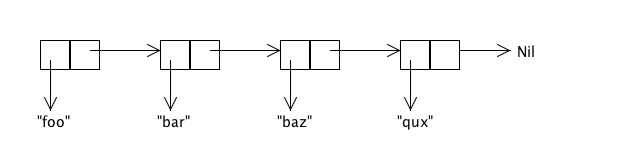
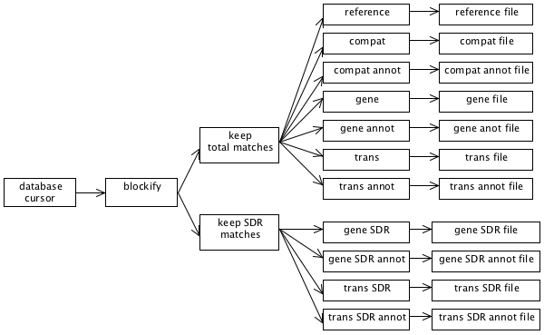

:title: The Structure of Streams
:subtitle: (... in Scala and How to Avoid Blowing Your Heap)
:slug: structure-of-streams
:date: 2012-03-23 23:38
:tags: scala, tutorials
:category: scala
:author: Douglas Alan

Streams are a staple of functional programming. They were invented for the
Scheme programming language, and then adopted and used heavily by Haskell. In
fact, they are used so heavily in Haskell that *all* Lists in Haskell are
really Streams. Streams offer a number of advantages for certain kinds of
programming tasks, but due to differences between Scala and Scheme or Haskell,
and for reasons that we will get into, in order to avoid exhausting the heap,
more care has to be taken when using Streams in Scala than you would have to in
either Scheme or Haskell.

Streams are heavily used in Clojure too, and in Clojure, Streams work just like
they do in Scala. Consequently, in Clojure the same level of care is also
required. So fear not that if you become proficient in the use Streams in
Scala, that this knowledge won't port to any other programming environment.

Given the subtlety of Streams in Scala, why would we ever want to use them?  I
won't attempt to provide an exhaustive answer to this question. Instead, I will
explain how I solved a specific real-world problem in production code using
Streams. The executive summary is that the program in question does a single
database query that results in writing out 11 different files, each of which
represents a different transformation of the data that is contained in that
single query. Since we cannot rely on the results of the query fitting into
ram, the data from the stream is processed in a streaming manner in 11
different ways. This sort of processing can be expressed very naturally using
Streams.

Sure, I could have had the program run 11 different queries instead, and
thereby simplified the structure and logic of the code, but then the program
would have been much slower. Since this program will ultimately run many times
a day, performance is an important factor.

What Are Streams?
=================

First of all, we should make it clear that the Streams we're talking about here
are not I/O streams. That usage of the term "stream" is another perfectly valid
use of the word, but it is also a completely different meaning of the
word. Streams, as described here, are a data type that exists in Scala and
other functional programming languages. This data type has no relation to I/O
streams, other than that they both refer to potentially never-ending
*sequential* sources of data.

Streams are a staple of functional programming. They are "lazy" lists. I.e., in
functional programming, a non-lazy List is a linked list data structure that
looks something like this:

The above diagram represents ``List("foo", "bar", "baz", "qux")``. It is made up
of a collection of "cons cells" [#cons]_, where each cell contains one
element of the list and a pointer to the rest of the list.

Note that the entire List is contained in ram. This fact can be mighty
inconvenient if you'd like to, say, have an infinite list. (I hear that an
infinite amount of ram is pricey these days on the spot market.) For instance,
let's say that we want a list that starts at 0, has 1 as its next element, and
then just keeps going forever. You might think that we're just SOL, but we
aren't. We just have to embrace the idea of a "lazy list", a.k.a., a "Stream".

A Stream is just like a List, except that where the cons cell of a List
contains a pointer to the rest of the List, the cons cell of a Stream contains
an anonymous function instead. When you call ".tail" on a List, the pointer is
followed to return the rest of the List. When you do the same thing on a
Stream, instead of the pointer being followed, the anonymous function in the
cons cell is called. This function then generates and returns the next cons
cell in the Stream. Since this new cons cell also contains its own anonymous
function, this process of generating new cons cells on demand can continue on
indefinitely. If and when there are no more elements in the stream, the
function in the last cons cell will return Stream.empty.

In summary, the cons cell returned by ".tail" on a Stream contains two
things:

#. The next element of the stream.
  
#. A function to generate the cons cell that comes after the next
   one.

In this fashion, the stream can generate *any* number of elements, and it
will do so only as the elements are actually needed.

In Scala, constructing the aforementioned infinite stream of the whole
numbers is exceptionally easy:

.. code-block:: scala

        val wholes = Stream.from(0)

I know, I know... you're thinking that this is all fine and nifty, but don't we
already have Iterators to serve this very purpose? Why, yes we do! And
Iterators are also nifty keen and can be used a lot like Streams are used. The
problem with Iterators is that they are not purely functional. I.e., a purely
functional data structure is immutable -- it cannot be modified. This property
allows us to reason more easily about certain properties of our programs. When
we pull from an Iterator, on the other hand, the Iterator is modified and this
can result in bugs. For instance, if you add some debugging code to print out
the next element of an Iterator, that debugging code has consumed that value
from the Iterator, and so that value will no longer make it to where it was
supposed to go. When you use Streams instead, this particular bug cannot
occur.

Composing Streams
=================

We created an infinite list of whole numbers above. Great! Now what? Hey, how
about we generate a Stream of all the even numbers. That's easy enough:

.. code-block:: scala

    	val evens = wholes map { _ * 2 }

Now let's add up the first 10 even number:

.. code-block:: scala

    	val sum10 = (evens take 10) sum

Now let's do an element-wise addition of all the odd and even numbers:

.. code-block:: scala

		val sumOfOddAndEvens = (evens zip odds) map { p => p._1 + p._2}

If we now do

.. code-block:: scala

   		sumOfOddAndEvens take 10 print

we'll see the following output:

.. code-block:: scala

    	1, 5, 9, 13, 17, 21, 25, 29, 33, 37, empty

That was fun, but let's try something a little trickier. We'll now make make an
infinite stream of Fibonacci numbers:

.. code-block:: scala

	val fibs: Stream[Int] = (
           1 #::
           1 #::
           ((fibs zip fibs.tail) map { p => p._1 + p._2 }))

``#::`` in Scala is the Stream cons operator. (You can also invoke it as
``Stream.cons()``.) The above line of code conses up a Stream where the first
element is 1, the next element is also 1, and then the rest of the stream is
created by zipping the infinite stream of Fibonacci numbers with itself, only
offset by one, and adding together the zipped pairs. Elegance incarnate!

One thing to note about how this works is that the code after ``#::`` above is
not run immediately. If it were, this wouldn't work, since ``fibs`` wouldn’t be
defined yet at the time it was being used. Everything to the right of ``#::``
is invoked via "call by name", which means that is wrapped up in an invisible
function literal, and that function is not called until it is needed.

Now let's get really funky and generate prime numbers! The following bit of
code will put an infinite stream of primes into the val ``primes``. Rad!

.. code-block:: scala

        def sieve(s: Stream[Int]): Stream[Int] =
           s.head #:: sieve(s.tail filter { _ % s.head != 0 })

        val primes = sieve(Stream.from(2))
	
The above code implements a Sieve of Eratosthenes, which is a way of itemizing
all the primes. Let's say that we were to perform by hand on paper the Sieve of
Eratosthenes algorithm. We might start by first writing down *all* the integers
that are greater than or equal to 2 on an infinitely big piece of paper. Then
we'd circle the smallest number that isn't already circled. Since we'd have
just started, that number will be 2, which is our first prime. Then we'd cross
off all the multiples of 2 that are on our infinite piece of paper. Once we'd
finished that, we'd go back to the circling step and circle the smallest number
that isn't already circled or crossed off. In this manner, the second number we
circled would be 3, which is our next prime. We'd then cross off all the
multiples of 3 from our infinite list. We'd lather, rinse, repeat until the end
of time, and when we'd finished, what's left is only circled numbers, and these
numbers are the primes.

So, how does the above code implement this? We'll leave that as an exercise for
the reader. Also, note that because Scala does not support fully general tail
recursion, this solution will blow the stack if you walk down the stream far
enough. (They say that Scala is the gateway drug to Haskell. In Haskell, you
would *not* blow the stack with this implementation. You *will* eventually blow
the heap in Haskell, as you need a little anonymous function for each non-prime
number, but there's no way to implement this algorithm without requiring
storage that continues to grow with the size of the prime that you are
currently at, so this will always be a problem no matter what you do.)

java.lang.OutOfMemoryError: Java heap space
===========================================

Unfortunately, all is not honeydew and milk of paradise in Streams Land. The
reason for this is that in Scala, a Stream caches the element values. Or
rather, a Stream cons cell caches the cons cell that is returned when you call
``.tail`` on it. The next time you call ``.tail`` on the cell, the Stream
implementation won't have to recompute the next cell using the anonymous
function that it contains. Instead, it will just return the cached cell.

This feature can be very handy at times. For instance, if you have a very
compute-intensive stream, and you need to walk down it several times, you may
not want to pay the full CPU cost each time you walk down it.

More significantly, if you use Streams for reading from a data source of some
kind, the data may not exist anymore if it were not cached. E.g., imagine that
you implement a stream that represents the output from a database query. In
this example, each element of the Stream is a row in the result set. Now let's
say that you walk down the Stream to fetch the tenth row, but you don't pay any
heed to first nine rows when you do so. Later you decide that you want the
fifth row. Too bad! It's gone. At least if the result set was provided by a
unidirectional database cursor, it is. Consequently, we can't tolerate this
sort of behavior from Streams--they are supposed to be purely functional, but
if walking down a Stream invalidates previous elements of the Stream, then
Streams are no different from Iterators. So, this is another reason that
Scala caches the element values for Streams.

Alas, this caching has a huge downside: You can easily exhaust the
entire heap if you are not *extremely* careful. E.g., if you fetch the
millionth row from a Stream that represents a database query, you
will almost certainly exhaust the heap, as all the other 999,999 rows
will end up being cached. What to do?!?

At this point, you might be interested to know that the programming language
Scheme, which is where Streams originated, does not cache Stream
values. Perhaps it doesn't do so as an answer to this very conundrum. The
downside for Scheme here is that Streams in Scheme are no good for reading I/O
for the reasons mentioned above. You might also be interested to know that
Scalaz provides a facility called Ephemeral Streams that are more like Scheme's
Streams. No doubt it also does so as an answer to this conundrum.

In any case, we now know what Scheme's approach to solving this problem
is. What's Scala's? To answer this, it might be instructive to think about how
Haskell handles this very same problem. Haskell's streams are just like Scala’s
Streams, so why doesn't Haskell have this problem?

The answer to this question is because in Haskell **everything** is lazy.

Let's take a step back and look at an example of how being
"strict" [#strict]_ rather than "lazy" comes back to bite us when
using Streams in Scala. Consider what happens if we do the following:

.. code-block:: scala

    	val evens = wholes map { _ * 2 }
        for (n <- evens) println(n)

At first blush, it would seem that this program will run forever. And if we had
an infinite amount of memory it would. But every time through the loop, the
stream bound to ``evens`` will cache one more value, and eventually something's
got to give. I.e., we'll rapidly exhaust the heap.

How is this problem avoided in Haskell [#haskell]_? The answer is that in
Haskell, *everything* is lazy. I.e., in Haskell the variable ``evens`` wouldn't
be bound to a Stream of even numbers when the first line is evaluated. What
happens in Haskell is the same thing that would happen if we were to do the
following in Scala:

.. code-block:: scala

    	def evens = wholes map { _ * 2 }
        for (n <- evens) println(n)

I.e., we've replaced the ``val`` keyword with ``def`` in order to define
``evens``. And this revised Scala program will in fact run forever.

One additional thing that you should keep in mind: Lazy vals in Scala are not
lazy enough to solve the problem here. If you were to replace ``def evens`` above
with ``lazy val evens``, the heap would still end up being exhausted.

The Tao of Tee
==============

It might sound at the moment as if Streams are not worth the trouble in
Scala. Sure, in Haskell you don't have to be careful with them since nothing is
strict. But in Scala, you have to code everything that uses Streams in a
somewhat different manner than you would typically do, and if you screw it up
anywhere, bye bye heap! Why not leave Streams to Haskell? Or just limit
ourselves to the Scheme kind of stream that doesn't have this issue?

But wait! Don't give up now! There is at least *one* use-case for Streams that
seems to be worth the trouble: Let's say you have a stream of data that needs
to be processed in several different ways, and you want to handle this
modularly. Sure, you could perhaps just write the entire stream to a temp file
and then process the temp file several ways before deleting it. Or you might
set up a list of callbacks to be invoked on each record in the stream. Or you
might represent the data stream as an iterator and then tee the iterator rather
than teeing a Stream. [#teeing]_

Those approaches can work fine, but arguably they are less elegant than using
Streams for this use-case. Streams *live* for this kind of task.

Streams are also very natural for when you have a pipeline of processing that
wants to be performed on a data stream. The Unix pipes model of modular
computation is a great success, and when you use Streams you can program
naturally in this style without having to have each pipeline element be a
separate program.

Now imagine a program that has a complex combination of *both* teeing and
piping: Streams can make this kind of thing, which might otherwise be daunting,
seem more approachable and natural. For example, the following diagram
represent the dataflow in a real bioinformatics program that I wrote:

Don't worry about the particular details of this diagram. The important thing
to note is that there is a stream of data coming from a database cursor. It
gets processed a bit. The processed data then gets split into two different
directions so that it can be filtered in two different ways. The filtered data
is then resplit and further processed in 11 different ways. Finally, the
processed data is written out to 11 different output files.

The following code does all the wiring that is represented in the above
diagram:

.. code-block:: scala

      private def processDataAndWriteFiles(iRows: IRows) {
        printToFile(compatFilename)         { compatFile         =>
        printToFile(compatAnnotFilename)    { compatAnnotFile    =>
        printToFile(geneFilename)           { geneFile           =>
        printToFile(geneAnnotFilename)      { geneAnnotFile      =>
        printToFile(geneSdrFilename)        { geneSdrFile        =>
        printToFile(geneSdrAnnotFilename)   { geneSdrAnnotFile   =>
        printToFile(transFilename)          { transFile          =>
        printToFile(transAnnotFilename)     { transAnnotFile     =>
        printToFile(transSdrFilename)       { transSdrFile       =>
        printToFile(transSdrAnnotFilename)  { transSdrAnnotFile  =>
        printToFile(referenceFilename)      { referenceFile      =>

          writeSyncedStreamsToFiles {

            val blocks               = toBlocks(iRows)
            val totalMatchBlocks     = filterByMatchPercent(blocks, requireTotalMatch=true)
            val sdrMatchBlocks       = filterByMatchPercent(blocks, requireTotalMatch=false)

            val compatOBlocks        = totalMatchBlocks map { _.compatOBlock }
            val geneOBlocks          = totalMatchBlocks map { _.geneOBlock   }
            val transOBlocks         = totalMatchBlocks map { _.transOBlock  }
            val geneSdrOBlocks       = sdrMatchBlocks   map { _.geneOBlock   }
            val transSdrOBlocks      = sdrMatchBlocks   map { _.transOBlock  }

            val compatAnnotOBlocks   = totalMatchBlocks map { _.compatAnnotOBlock   }
            val geneAnnotOBlocks     = totalMatchBlocks map { _.geneAnnotOBlock     }
            val transAnnotOBlocks    = totalMatchBlocks map { _.transAnnotOBlock    }
            val geneSdrAnnotOBlocks  = sdrMatchBlocks   map { _.geneSdrAnnotOBlock  }
            val transSdrAnnotOBlocks = sdrMatchBlocks   map { _.transSdrAnnotOBlock }

            val referenceOBlocks     = totalMatchBlocks map { _.referenceOBlock }

            val pipelines: StreamPipelines = Seq(
              header(CompatColNames)        ++ compatOBlocks         -> compatFile,
              header(GeneColNames)          ++ geneOBlocks           -> geneFile,
              header(TransColNames)         ++ transOBlocks          -> transFile,
              header(GeneColNames)          ++ geneSdrOBlocks        -> geneSdrFile,
              header(TransColNames)         ++ transSdrOBlocks       -> transSdrFile,

              header(CompatAnnotColNames)   ++ compatAnnotOBlocks    -> compatAnnotFile,
              header(GeneAnnotColNames)     ++ geneAnnotOBlocks      -> geneAnnotFile,
              header(TransAnnotColNames)    ++ transAnnotOBlocks     -> transAnnotFile,
              header(GeneSdrAnnotColNames)  ++ geneSdrAnnotOBlocks   -> geneSdrAnnotFile,
              header(TransSdrAnnotColNames) ++ transSdrAnnotOBlocks  -> transSdrAnnotFile,

              Stream(Nil)                   ++ referenceOBlocks      -> referenceFile)

            pipelines
          } // end writeSyncedStreamsToFiles

        } } } } } } } } } } } // end printToFile

      } // end processDataAndWriteFiles()

Let's break this code down line by line, so that it might seem less
daunting. The following chunk of code opens up 11 different output files and
puts the output PrintWriters into the vals ``compatFile``, ``compatAnnotFile``,
etc.:

.. code-block:: scala

        printToFile(compatFilename)         { compatFile         =>
        printToFile(compatAnnotFilename)    { compatAnnotFile    =>
        printToFile(geneFilename)           { geneFile           =>
        printToFile(geneAnnotFilename)      { geneAnnotFile      =>
        printToFile(geneSdrFilename)        { geneSdrFile        =>
        printToFile(geneSdrAnnotFilename)   { geneSdrAnnotFile   =>
        printToFile(transFilename)          { transFile          =>
        printToFile(transAnnotFilename)     { transAnnotFile     =>
        printToFile(transSdrFilename)       { transSdrFile       =>
        printToFile(transSdrAnnotFilename)  { transSdrAnnotFile  =>
        printToFile(referenceFilename)      { referenceFile      =>

``printToFile()`` is a function defined elsewhere [#printToFile]_ that uses the "loan pattern" in
order to act as an "unwind protect", making sure that an open file gets
closed. ``printToFile()`` opens the file specified by the filename. The resulting
PrintWriter (i.e., the output I/O object) is bound to the specified val, and
the PrintWriter is automatically closed when the scope is left. I.e., here all
the output files will be automatically closed at the end of
``processDataAndWriteFiles()``.

The next line of ``processDataAndWriteFiles()`` calls a function (implemented
elsewhere) that arranges to write out all of the streams to their respective
files:

.. code-block:: scala

       writeSyncedStreamsToFiles {
       
We'll come back to this later, as its implementation is a bit tricky.

The following few lines implement the first tee shown in the diagram that we
looked at a short while ago:

.. code-block:: scala

        val blocks               = toBlocks(iRows)
        val totalMatchBlocks     = filterByMatchPercent(blocks, requireTotalMatch=true)
        val sdrMatchBlocks       = filterByMatchPercent(blocks, requireTotalMatch=false)

The first line above chunks the query rows into blocks of rows and the next two
lines each filter that Stream of blocks, but in two different ways.

*Precisely* what ``toBlocks()`` and ``filterByMatchPercent()`` do isn't relevant to
this discussion. All that you need to understand is (1) that ``toBlocks()``
transforms a Stream of rows into a Stream with the same data, only the rows
have been grouped into blocks of rows and (2) that ``filterByMatchPercent()``
transforms a Stream containing a block of rows into a Stream containing the same
blocks, but where rows may have been filtered out of each block.

Also, don't forget that the filtering isn't actually happening now, but rather
we are just constructing new Streams, for which the actual computations are
delayed until the results are actually needed.

When looking at the above code, you may say to yourself, "But Doug, you told me
that I couldn't use vals, not even lazy vals, to hold streams!" Yes, I might
have hinted as much, didn't I? That's not completely right, however. The reason
why it's okay to use vals in the code above to hold streams is because these
vals will have all left scope by the time the streams are actually
traversed. Since these vals won't be on the stack (or preserved in closures)
when the streams are used, they won't be holding onto the front of the
streams. It is the "front holding" that causes the problems.

To see that vals will no longer be in scope, notice that the vals are only
used to construct a Seq (which in this case, is just a standard List), and then
the Seq is returned out of the scope of the "vals" so that the front of the Streams
are not being held onto anymore by the vals--the Stream fronts are only being
held onto by the returned Seq.

Before moving onto the implementation of ``writeSyncedStreamsToFiles()``, let's
finish looking at the wiring that takes place in
``processDataAndWriteFiles()``:

.. code-block:: scala

            val compatOBlocks        = totalMatchBlocks map { _.compatOBlock }
            val geneOBlocks          = totalMatchBlocks map { _.geneOBlock   }
            val transOBlocks         = totalMatchBlocks map { _.transOBlock  }
            val geneSdrOBlocks       = sdrMatchBlocks   map { _.geneOBlock   }
            val transSdrOBlocks      = sdrMatchBlocks   map { _.transOBlock  }

            val compatOBlocks        = totalMatchBlocks map { _.compatOBlock }
            val geneOBlocks          = totalMatchBlocks map { _.geneOBlock   }
            val transOBlocks         = totalMatchBlocks map { _.transOBlock  }
            val geneSdrOBlocks       = sdrMatchBlocks   map { _.geneOBlock   }
            val transSdrOBlocks      = sdrMatchBlocks   map { _.transOBlock  }

            val compatAnnotOBlocks   = totalMatchBlocks map { _.compatAnnotOBlock   }
            val geneAnnotOBlocks     = totalMatchBlocks map { _.geneAnnotOBlock     }
            val transAnnotOBlocks    = totalMatchBlocks map { _.transAnnotOBlock    }
            val geneSdrAnnotOBlocks  = sdrMatchBlocks   map { _.geneSdrAnnotOBlock  }
            val transSdrAnnotOBlocks = sdrMatchBlocks   map { _.transSdrAnnotOBlock }

If you examine the above code, you'll see that we re-tee the original two tees
into 11 new directions, where each of the resulting tee branches is processed
with a different transformation.

We then construct the Seq that we just talked about a few paragraphs back:

.. code-block:: scala

            val pipelines: StreamPipelines = Seq(
              header(CompatColNames)        ++ compatOBlocks         -> compatFile,
              header(GeneColNames)          ++ geneOBlocks           -> geneFile,
              header(TransColNames)         ++ transOBlocks          -> transFile,
              header(GeneColNames)          ++ geneSdrOBlocks        -> geneSdrFile,
              header(TransColNames)         ++ transSdrOBlocks       -> transSdrFile,

              header(CompatAnnotColNames)   ++ compatAnnotOBlocks    -> compatAnnotFile,
              header(GeneAnnotColNames)     ++ geneAnnotOBlocks      -> geneAnnotFile,
              header(TransAnnotColNames)    ++ transAnnotOBlocks     -> transAnnotFile,
              header(GeneSdrAnnotColNames)  ++ geneSdrAnnotOBlocks   -> geneSdrAnnotFile,
              header(TransSdrAnnotColNames) ++ transSdrAnnotOBlocks  -> transSdrAnnotFile,

              Stream(Nil)                   ++ referenceOBlocks      -> referenceFile)

The Seq that we construct is a List of tuples, where each tuple contains a
Stream and an output file. The function ``writeSyncedStreamsToFiles()`` will
write each of the Streams to the corresponding file.

Notice that we also prepend a header onto each output stream. In this case, the
output files are TSV files and the headers will be tab-separated column names,
but that detail isn't particularly relevant to this discussion.

Also note that on the last line shown above we prepend a null header. The
reason for this is that that particular output file doesn't have a header, but
we need to append something onto the beginning of the Stream anyway, since all
of the Streams to be output must have exactly the same number of elements. This
requirement is to make sure that all of the Streams stay in sync with each
other when we go to write them to their output files. If they were to drift out
of sync, then the Stream implementation would end up having to cache all the
elements of parent streams that represent the difference between the fasted
child stream and the slowest child stream. But if we make sure that all of the
streams are consumed at the same rate, then we don't end up having to cache
much at all.

The Sanctity of Synchrononization
=================================

So, now let's look at the code that does the actual writing of the data in the
Streams to their output files. The following is the definition of
``writeSyncedStreamsToFiles()``, which we discussed a bit earlier:

.. code-block:: scala

        private type StreamPipeline = (Stream[OBlock], PrintWriter)

        private def writeSyncedStreamsToFiles(pipeline: => Seq[StreamPipeline]) {
          processSyncedStreams {
            pipeline map { pair =>
              val stream = pair._1
              val out = pair._2
              val retval = (stream,
                            { printTsvLineFromSeq(out, _: ORow) })
              retval
            }
          }
        }

This function takes as its argument a Seq of tuples, where each tuple contains
a Stream and the PrintWriter to which the Stream is to be written. It delegates
most of the work to ``processSyncedStreams()`` however. The reason for this
delegation is that ``processSyncedStreams()`` is just a bit more general. The
tuples that ``writeSyncedStreamsToFiles()`` work on each contain a Stream and an
output PrintWriter, while the tuples that ``processSyncedStreams()`` work on each
contain a Stream and a function to process each element of the Stream. The
above function, ``writeSyncedStreamsToFiles()`` exists just to transform the
output PrintWriters into functions that write to the PrintWriters.

Note that in the above function we extract the tuple elements into vals named
``stream`` and ``out``. This is required to prevent heap exhaustion. The reason for
this is that if ``pair._1`` and or ``pair._2`` had been used directly in the
function literal that is used in the construction of ``retval``, then the
resulting closure would end up holding onto ``pair``, which would then end up
holding onto ``pair._1``, which is the front of a Stream. Holding onto the front
of a Stream here would ultimately cause the heap to be exhausted.

So, you can probably now see that this "last ten yards" of dealing with Streams
is fraught with peril. Ideally, we will ultimately generalize these functions
and move them into a reusable library, where we won't ever have to mess with
them again. When this happens, the issues we are fretting over now will be
mostly moot.

Now let's look at the implementation of ``processSyncedStreams()``:

.. code-block:: scala

        private type StreamProcess = (Stream[OBlock], ORow => Unit)

        private def processSyncedStreams(processes: => Seq[StreamProcess]) {
          loop(processes)

          @tailrec
          def loop(processes: Seq[StreamProcess]) {

            // We define these just to make the following code more self-explanatory:
            def getStream(p: StreamProcess) = p._1
            def getProc  (p: StreamProcess) = p._2

            // This is a view because most of the time we only need the first element:
            val streams = (processes map { _._1 }).view

            // If we've hit the end of the first stream, make sure that we've also hit the end
            // everywhere else:
            if (streams(0).isEmpty) {
              for (stream <- streams)
                assertData(stream.isEmpty, "All the streams in the tee should end at the same.")
            } else {

              // If we haven't hit the end of the first stream, then run each proc on its respective
              // stream head:
              for ((stream, proc) <- processes) {
                assertData(!stream.isEmpty, "The streams in the tee should all end at the same.")
                val rows = stream.head
                rows foreach proc
              }

              // And then loop over the stream tails:
              loop(processes map { x => (getStream(x).tail,
                                         getProc(x)) })
            }
          }
        }

This function was implemented using tail recursion, but it could just have
easily been implemented with a while loop. We implemented here using tail
recursion just to keep in the purely functional spirit with which we started
this venture.

If you can remember a few pages back, we mentioned that we needed to keep all
the Streams synchronized with each other in order to prevent any of the Streams
from pulling on the database cursor faster than any other. I.e., all of the
streams need to pull on the database cursor at the same rate. If this rule is
broken, then many rows from the database cursor could end up being cached by the
Stream implementation, and this would likely blow the heap.

Consequently, what the above function does is to walk down all of the Streams
in lockstep. On each iteration of the loop, it calls each Stream's processing
function on the head of the Stream. Then it reconstructs the Seq so that the
new Seq contains all of the *tails* of the Streams. This frees up what was
previously the first cons cell of each Stream so that these cons cells can be
garbage-collected. The loop continues on like this until the ends of all of the
Streams are reached. When this happens, ``processSyncedStreams()`` is done and it
returns. If the Streams have no ends (i.e., they are infinite), then this
function will loop forever, and yet it won't exhaust the heap.

Conclusion
==========

Now you will hopefully see, if your head doesn't hurt too much from all of this
fussy exposition, that in Scala using Streams can be an elegant and expressive
technique for solving problems that have an inherent dataflow structure to
them. I.e., when the data processing is naturally expressed as data pipelines
and/or tees.

Footnotes
=========

.. [#cons] The term "cons" is a bit of historical terminology from the Lisp
   programming language dating back to 1956. It stands for "construct".

.. [#strict] "Strict" is the opposite of "lazy". Almost all programming
   languages are strict. Haskell is a rare exception. Haskell delays the
   evaluation of everything as long as it possibly can, while other programming
   languages typically evaluate everything right away. Scala allows you to specify
   that certain things should be evaluated lazily, however. E.g., you can declare
   a val to be lazy or you can use ``def`` to also define a name that is evaluated
   lazily. For function parameters, you can declare them to be call-by-name, which
   is very similar to defining a name using ``def``.

.. [#haskell] An interesting factoid about Haskell is that Haskell does not call
   Streams, "Streams". Haskell is so lazy that Lists in Haskell turn out to *be*
   Streams and consequently no seperate data type is needed. Also, the syntax of
   Haskell is, of course, different from the syntax of Scala, but let's pretend
   for the moment that their syntax is the same just to make the discussion
   easier.

.. [#teeing] When teeing an iterator, however, you still have to program very
   carefully to avoid exhausting the heap. The reason for this is that if the
   iterators get out of sync with each other, the program will either do the wrong
   thing, or it will have a buffer that buffers up the data inbetween the location
   of the slowest iterator and the fastest iterator, and if this gap grows large,
   it will consume a lot of ram.

.. [#printToFile] This is how ``printToFile()`` is implemented:

.. code-block:: scala

        def printToFile(file: File)(body: PrintWriter => Unit) {
          val p = new PrintWriter(file)
          try body(p)
          finally p.close()
        }

        def printToFile(filepath: String)(body: PrintWriter => Unit) {
          printToFile(new File(filepath))(body);
        }
